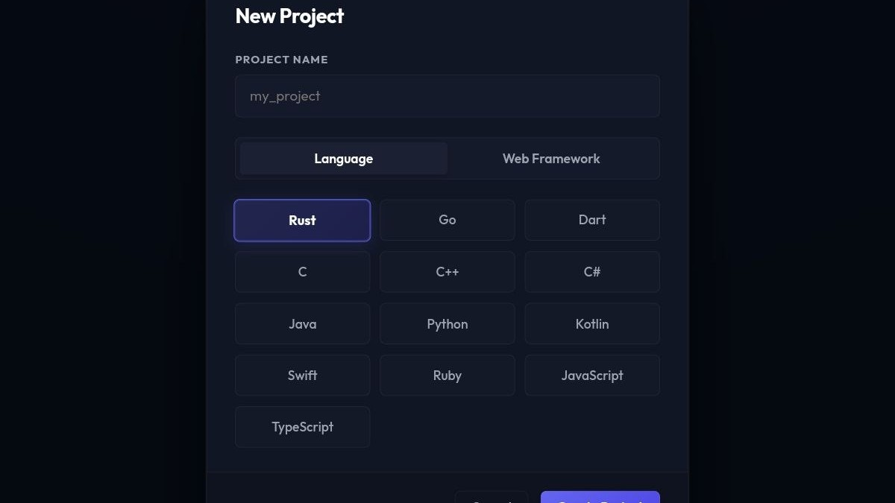
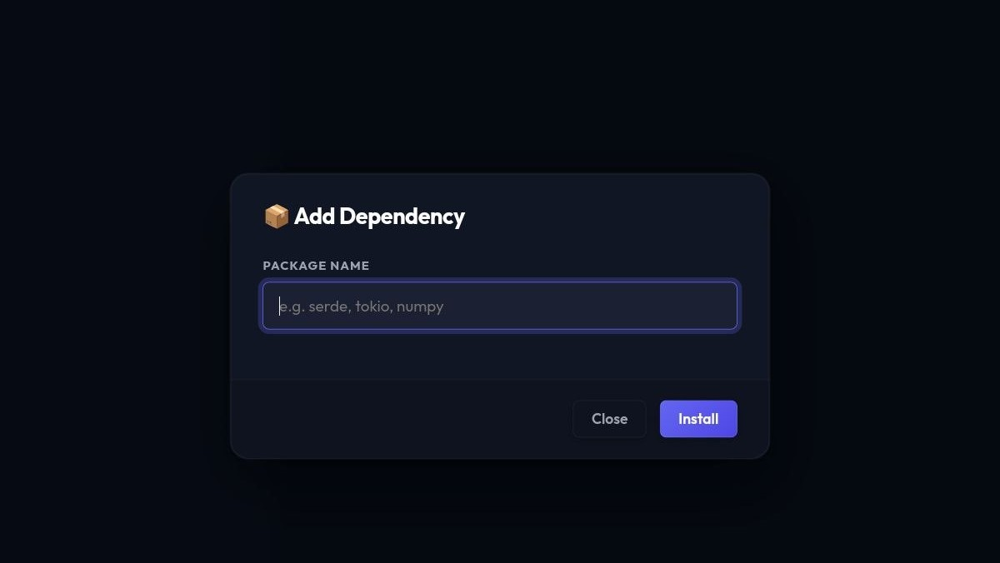
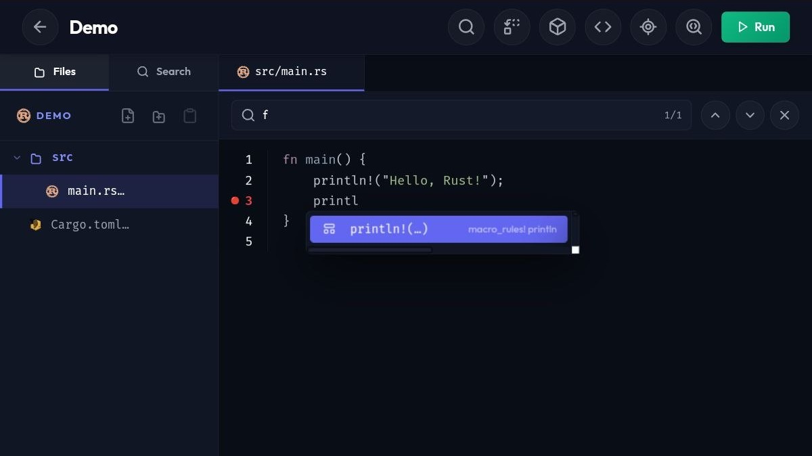
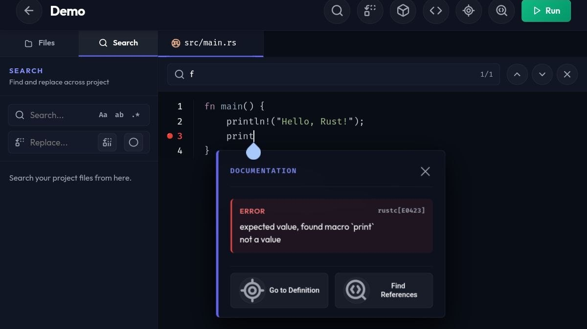
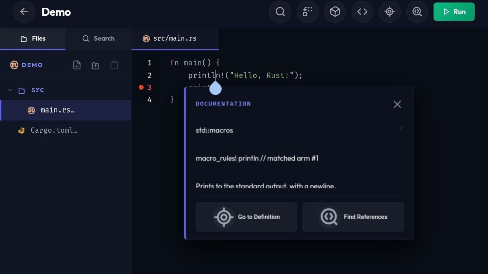
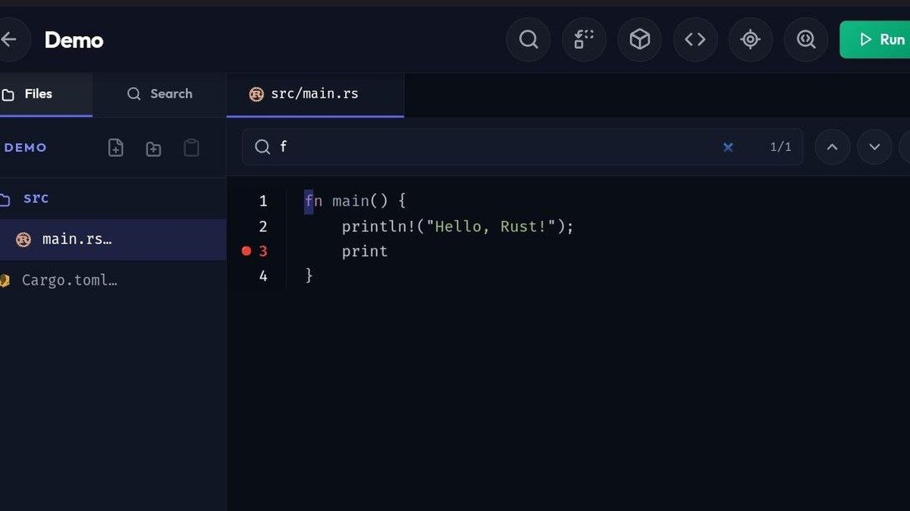
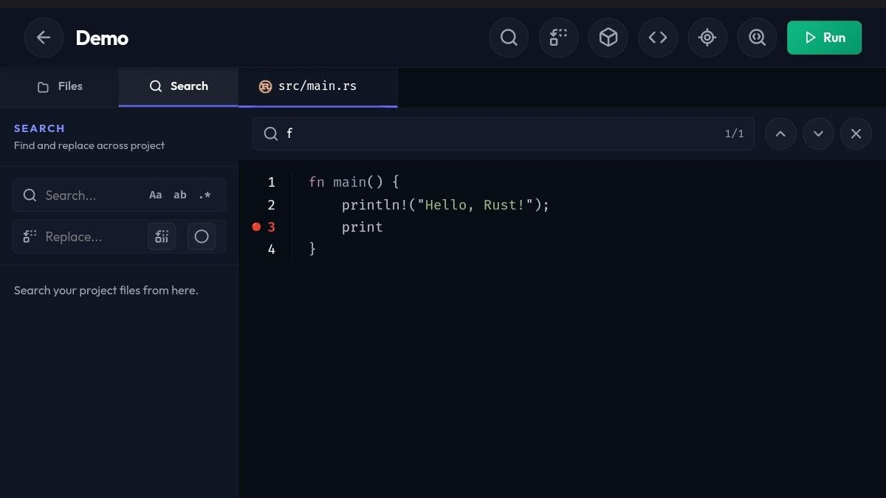

# CodeDroid — Mobile Code Execution Engine for Android & iOS

<p align="center">
  
  
  
  
  
  
</p>
<p align="center">
  
  
  
  
  
</p>

> **Free, open-source mobile IDE and code execution engine** — write and run Python, Rust, Go, JavaScript, Java, C++, and 13+ languages directly on your Android or iOS device. No laptop needed.

<p align="center">
  <a href="https://codedroid.netlify.app" target="_blank">
    
  </a>
  <a href="./TERMUX_SETUP.md">
    
  </a>
  <a href="./CONTRIBUTING.md">
    
  </a>
  <a href="https://discord.gg/5srCEqsht" target="_blank">
    
  </a>
  <a href="https://t.me/codedroid133" target="_blank">
    
  </a>
  <a href="https://www.youtube.com/@CodeDroidYT" target="_blank">
    
  </a>
</p>

---

## What is CodeDroid?

CodeDroid is a **mobile programming environment** built for developers who code everywhere. Under the hood, it's a high-performance HTTP API server written in **Rust (Axum)** that communicates with your device's actual compilers and runtimes — not a sandbox, not a toy.

It pairs with an integrated **Leptos-based Web IDE** (compiled to WASM) that delivers a desktop-class coding experience on mobile. You get IntelliSense, real package managers, and even web server previews — all running on your phone via **Termux**.

---

## 📱 Application Preview

| Create a New Project | Add Dependencies |
| :---: | :---: |
|  |  |

| Auto Completion & Suggestions | Error Diagnostics | Hover Documentation |
| :---: | :---: | :---: |
|  |  |  |

| In-File Search | Global Project Search |
| :---: | :---: |
|  |  |

---

## ✨ Features

- **Mobile-First Responsive Layout** — Optimized interface for touch devices, viewport overlays, and smaller screen form factors (320px–768px). Features a slide-out file explorer overlay drawer, auto-collapsing sidebar upon opening files, persistent touch targets for closing tabs/deleting projects, and layouts utilizing CSS `100dvh` to handle virtual keyboards elegantly.
- **Real-Time Execution Engine** — Runs code using actual system compilers (`rustc`, `gcc`, `python3`, `go`, `clang`, etc.). Real native execution with live output streams, stdout/stderr capture, and run process termination controls (PID-based).
- **LSP-powered IntelliSense** — Floating completions, code diagnostics, hover documentation, and error overlays via system language servers (`rust-analyzer`, `typescript-language-server`, `gopls`, `clangd`, `pylsp`, etc.) running on-device. Optimized to auto-hide extra details panels on mobile screens to prevent viewport overflow.
- **Save-Triggered Updates** — Supports `textDocument/didSave` notifications to automatically sync files to the local disk and instantly refresh compilation diagnostics.
- **Comprehensive Web Technology Support** — Native LSP mapping and server initialization for web languages including HTML, CSS, JavaScript, TypeScript, JSX, TSX, Svelte, Vue, and Angular.
- **Full Package Manager Integration** — Auto-detects and installs dependencies using `npm`, `pip3`, `cargo`, `pub`, `go get`, and custom package managers before run execution.
- **Live Web Preview & Refresh** — Auto-detects dev server URLs (e.g. Vite, Webpack) from stdout logs, featuring an in-editor browser preview with manual/automatic refresh, and remote/iOS client accessibility via local network IP resolution.
- **Standard Project Scaffolding Templates** — Bootstrap projects with pre-configured modern templates for React (Vite), Vue (Vite), Svelte (Vite), Next.js (App Router), Remix, and Angular.
- **Advanced File Management & Sidebar Drawer** — Dynamic side drawer directory tree viewer with navigation, context-aware file actions (create, delete, copy, paste), and full **Rename & Move** support for both files and directories with LocalStorage synchronization.
- **Bracket Matching & Typing Aids** — Automatic matching bracket insertion and paired deletion helpers in the Web IDE editor.
- **Highly Configurable & Offline** — Works fully offline with local-first storage sync. Easily configure custom backend API endpoints with a built-in server connection test utility.

---

## 🛠️ Supported Languages & IntelliSense

| Language | Runtime | Package Manager | LSP / IntelliSense |
|---|---|---|---|
| [**Rust**](./docs/languages/rust.md) | `cargo` / `rustc` | `cargo` | ✅ `rust-analyzer` |
| [**Python**](./docs/languages/python.md) | `python3` | `pip3` | ✅ `pylsp` |
| [**Go**](./docs/languages/go.md) | `go run` | `go get` | ✅ `gopls` |
| [**JavaScript**](./docs/languages/javascript.md) / [**TS**](./docs/languages/typescript.md) | `node` / `tsx` | `npm` | ✅ `typescript-language-server` |
| [**C**](./docs/languages/c.md) / [**C++**](./docs/languages/cpp.md) | `gcc` / `g++` / `clang` | `pkg install` | ✅ `clangd` |
| [**Dart**](./docs/languages/dart.md) | `dart` | `pub` | ✅ `dart language-server` |
| [**Java**](./docs/languages/java.md) | `javac` + `java` | Maven | ✅ `jdtls` |
| [**Kotlin**](./docs/languages/kotlin.md) | `kotlinc` | — | ✅ `kotlin-language-server` |
| [**Swift**](./docs/languages/swift.md) | `swift` | SPM | ✅ `sourcekit-lsp` |
| [**C#**](./docs/languages/csharp.md) | `dotnet` | `nuget` | — |
| [**Ruby**](./docs/languages/ruby.md) | `ruby` | `gem` | ✅ `solargraph` |
| [**R**](./docs/languages/r.md) | `Rscript` | — | — |
| [**Scala**](./docs/languages/scala.md) | `scala` | — | — |
| [**Perl**](./docs/languages/perl.md) | `perl` | — | — |
| [**Haskell**](./docs/languages/haskell.md) | `runhaskell` | — | — |
| [**Pascal**](./docs/languages/pascal.md) | `fpc` | — | — |


---

## 🚀 Getting Started

### Prerequisites

- Android device with [Termux](https://termux.dev) installed, **or** a Linux/macOS/Windows machine.
- For the hosted Web IDE: any modern browser at **[codedroid.netlify.app](https://codedroid.netlify.app)**.

### Mobile Setup (Android / Termux)

Full step-by-step instructions: 👉 **[TERMUX_SETUP.md](./TERMUX_SETUP.md)**

---

## 📡 API Reference

CodeDroid exposes a simple HTTP API. All endpoints accept and return JSON.

### `POST /run` — Execute Code

Run code in any supported language. Returns `stdout`, `stderr`, and (for web projects) the live server URL.

### `POST /complete` — Get Code Completions

Returns LSP-powered code suggestions for the given cursor position.

```json
{
  "code": "fn main() { pri",
  "language": "rust",
  "project_path": "/home/my_project",
  "line": 0,
  "character": 15
}
```

### `POST /sync_file` — Sync File to Disk

Creates or updates a file on the device. Required for LSP and multi-file projects.

### `POST /stop` — Stop a Running Process

Kills a long-running process (e.g., a dev server) by PID.

---

## 🏗️ Architecture

```
       [ Web IDE — Leptos / WASM ]
                   │
           HTTP / JSON Requests
                   ▼
    [ CodeDroid API Server — Rust / Axum ]
          │                   │
    [ LSP Servers ]     [ System Runtimes ]
  (rust-analyzer,        (python3, cargo,
   clangd, gopls…)        gcc, node, go…)
```

---

## 💻 Tech Stack

| Layer | Technology |
|---|---|
| API Server | [Rust (Axum)](./codedroid_api/README.md) |
| Web IDE | [Leptos (WASM)](./codedroid_frontend/README.md) |
| IntelliSense | LSP (Language Server Protocol) |
| Runtime | Termux (Android), Linux, macOS, Windows |

---

## 🔮 Upcoming Features / Roadmap

We are constantly improving CodeDroid to deliver a desktop-grade IDE experience on mobile. Here are the features planned for upcoming releases:

- **Browser-Only Mode (Offline-First PWA)**: Enable a lightweight execution fallback using WASM-based compilers (e.g., WebContainers or in-browser Python/JS runtimes) so you can run simple code snippets without setting up a backend.
- **Local File System Access (OPFS / File System Access API)**: Allow the Web IDE to open, modify, and save directories directly on your device's filesystem without needing the backend bridge.
- **Advanced LSP Actions**: Add support for Go to Definition, Find References, and Rename refactoring directly inside the editor UI.
- **Git & GitHub Integration**: Integrated source control to clone repositories, track changes, view diffs, make commits, and push/pull directly from the editor.
- **Interactive Terminal Emulator**: A fully interactive Web Terminal component (via `xterm.js`) connected to your device's shell (e.g., Termux bash/zsh), rather than just viewing static execution logs.
- **Collaboration & Pair Programming**: Connect multiple frontend Web IDEs to a single backend session for real-time remote collaboration.
- **Custom Themes & Extension Support**: Add VS Code-compatible custom themes and editor keybindings (such as Vim/Emacs keymaps).

---

## 🤝 Contributing

Contributions are welcome. Please read **[CONTRIBUTING.md](./CONTRIBUTING.md)** for guidelines on reporting bugs, suggesting features, and submitting pull requests.

---

## 📄 License

GNU General Public License v3.0 — see [LICENSE](LICENSE) for full terms.

---

## 💬 Community & Support

Join our community to chat with other developers, get help, and stay updated:

- **Discord**: [Join our Discord Server](https://discord.gg/5srCEqsht) to chat, get support, and share feedback.
- **Telegram**: [Subscribe to our Telegram Channel](https://t.me/codedroid133) for the latest news and updates.
- **YouTube**: [Subscribe to our YouTube Channel](https://www.youtube.com/@CodeDroidYT) to watch video tutorials and feature previews.

---

## 👤 Author

**Md Apon Ahmed**
GitHub: [@apon133](https://github.com/apon133)

---

*CodeDroid — Because real developers code everywhere.*